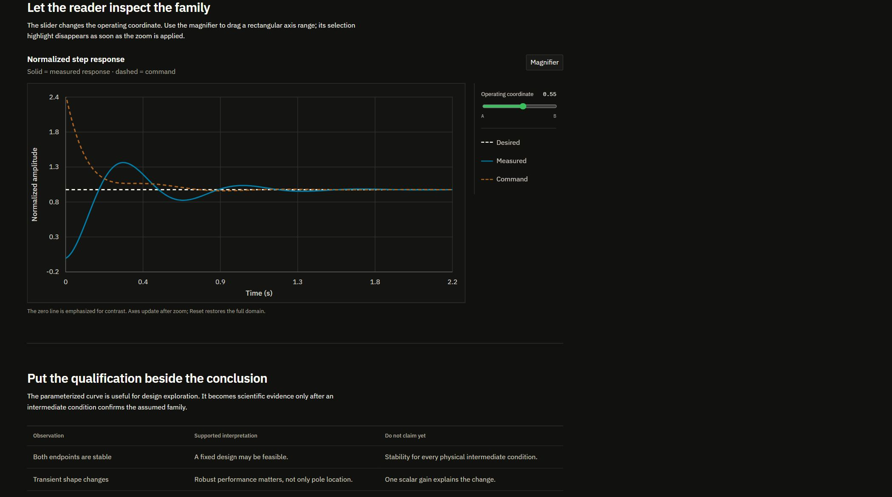

# Technical Report Skill

An agent-first Codex skill for building modular, publication-style technical report websites with multiple articles, sticky navigation, MathML equations, reusable evidence blocks, and dependency-free interactive SVG plots.



## What agents get

- A runnable HTML/CSS/JavaScript report template with no build step.
- A configuration-driven multi-article system; adding an article requires one component and one registry entry.
- A documented typography, spacing, color, motion, and responsive-layout system.
- Reusable blocks for decisions, caveats, metrics, literature tables, equations, workflows, and system diagrams.
- An interactive plot module with a slider, accessible series toggles, drag-to-zoom, disappearing selection highlight, and Reset.
- Deterministic scaffolding and structural validation scripts.
- Progressive-disclosure references so agents load only the instructions needed for the current edit.

## Repository layout

```text
skills/build-technical-report/
├── SKILL.md
├── agents/openai.yaml
├── assets/report-template/
├── references/
└── scripts/
```

The installable skill is isolated under `skills/`; repository documentation and screenshots stay outside the skill package.

## Install

Copy `skills/build-technical-report` into your Codex skills directory:

```powershell
Copy-Item -Recurse skills\build-technical-report "$env:CODEX_HOME\skills\build-technical-report"
```

Then invoke it with a prompt such as:

```text
Use $build-technical-report to turn this controller study into a three-article interactive technical report.
```

## Direct use

Scaffold a report without installing the skill:

```powershell
python skills/build-technical-report/scripts/scaffold_report.py .\my-report `
  --title "Robust controller study" `
  --brand "Controls Lab" `
  --accent "#39BF5E"
```

Validate and serve it:

```powershell
python skills/build-technical-report/scripts/validate_report.py .\my-report
python -m http.server 8010 --directory .\my-report
```

Open `http://127.0.0.1:8010/`.

## Design intent

The template favors evidence density over dashboard decoration: restrained dark surfaces, thin rules, compact controls, a 20/60/20 editorial layout, and explicit separation between demonstrated results, assumptions, and recommendations. It includes reduced-motion, mobile, and print treatments.

## License

MIT

